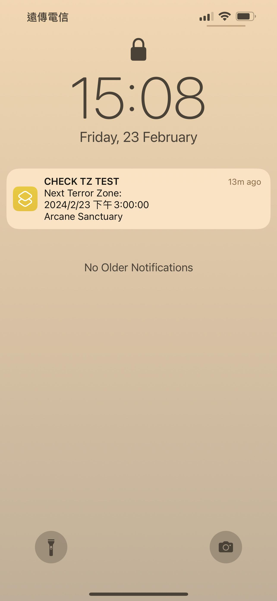
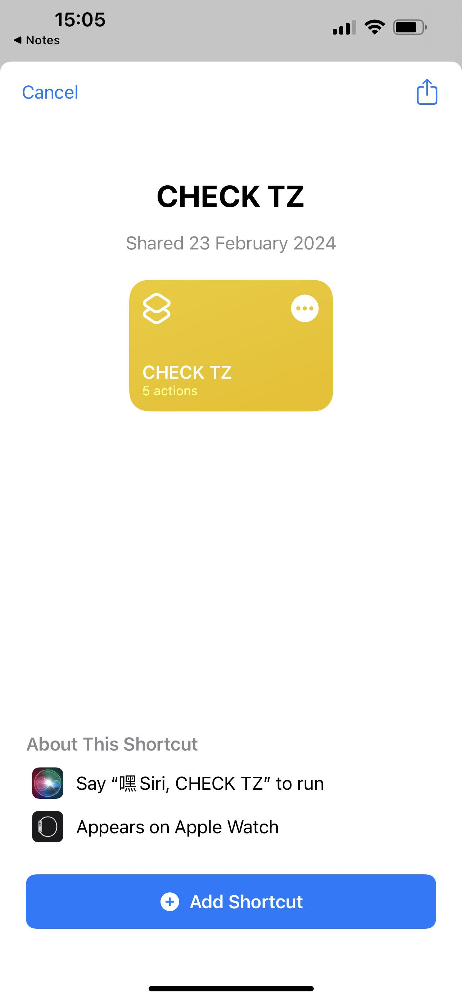
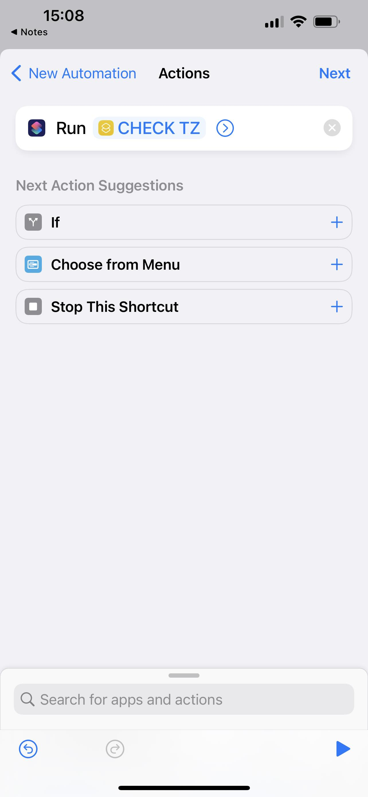
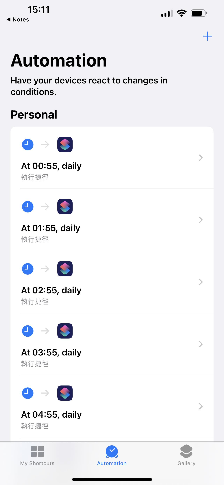
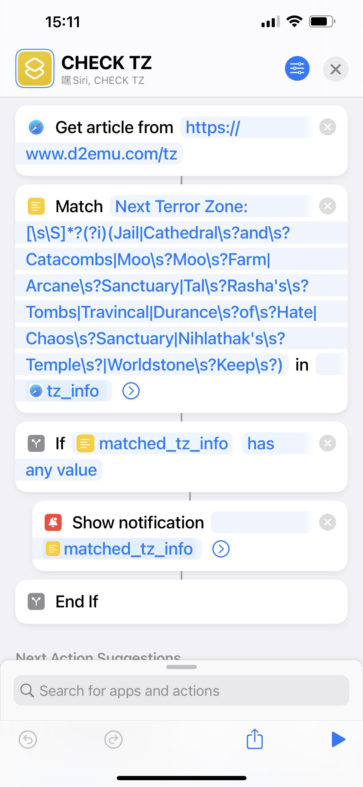

# Terror Zone Alert (Getting Notified 1 hour Before)
Often times when I am online, the zone is not good. That's why I make this tool, when there is a good terror zone coming, I can get notified in advance.  
You can adjust the notification to the zones you like. The default is Jail, Cathedral and Catacombs, Moo Moo Farm, Arcane Sanctuary, Tal Rasha's Tombs, Travincal, Durance of Hate, Chaos Sanctuary, Nihlathak's Temple, Worldstone Keep.  
(Now only support APPLE product)  


# Install
1. Turn on your iPhone. Go to <https://www.icloud.com/shortcuts/02fc987248f646d7b04dcdd561e184db> to down load this shortcut. Turn on `Shortcut` App. You should be able to find the shortcut I wrote, `CHECK TZ`. Click and run. It will ask for some permissions at the first time running. This shortcut will check if there is a "good zone" coming. If so, it will show notification.  


2. Make shortcut run at 6:55 everyday: Go to `Shortcut` APP. Bottom middle, `Automation`. Click `+` on top right. `Create Personal Automation`. `Time of Day`. 6:55. Add `Run Shortcut` action. And set `CHECK TZ`. Unselect "Ask Before Running" (Its important). Done.  


3. Repeat step two for 7:55, 8:55,...0:55. This way you will be notified 5 minutes earlier whenever there is a good zone coming. Change the time as you wish.  


# Adjust "Good Zone"
How this tool works is easy. <www.d2menu.com/tz> already listed the zone next hour. The shortcut get the content. Use regular expression to filter and send notification.  
  
So just adjust the regular expression, if you want to add or remove the "Good Zone". For example, below regular expression matches Jail, Cathedral and Catacombs, Moo Moo Farm, Arcane Sanctuary, Tal Rasha's Tombs, Travincal, Durance of Hate, Chaos Sanctuary, Nihlathak's Temple, Worldstone Keep.
```
Next Terror Zone:[\s\S]*?(?i)(Jail|Cathedral\s?and\s?Catacombs|Moo\s?Moo\s?Farm|Arcane\s?Sanctuary|Tal\s?Rasha's\s?Tombs|Travincal|Durance\s?of\s?Hate|Chaos\s?Sanctuary|Nihlathak's\s?Temple\s?|Worldstone\s?Keep\s?)
```
Add The Forgotten Tower by adding `The\s?Forgotten\s?Tower`.
```
Next Terror Zone:[\s\S]*?(?i)(The\s?Forgotten\s?Tower|Jail|Cathedral\s?and\s?Catacombs|Moo\s?Moo\s?Farm|Arcane\s?Sanctuary|Tal\s?Rasha's\s?Tombs|Travincal|Durance\s?of\s?Hate|Chaos\s?Sanctuary|Nihlathak's\s?Temple\s?|Worldstone\s?Keep\s?)
```

# Enjoy!
You can give me some JAH or BER through <https://www.buymeacoffee.com/chriswu>.
