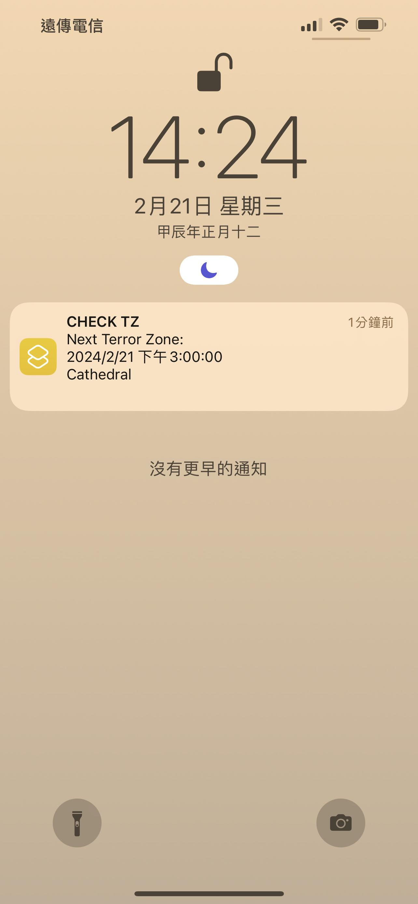
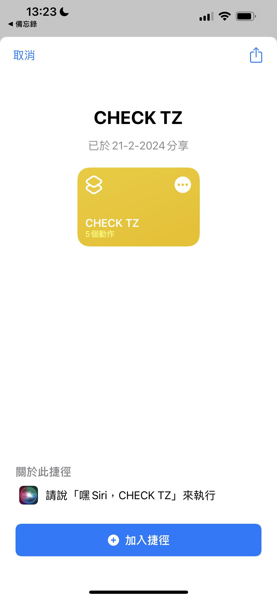
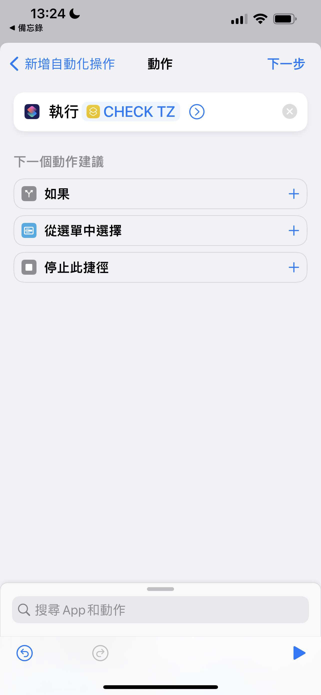

# 邪惡威脅警報器 提前一小時收到通知
因為常常上線都沒有喜歡的區域，而每次記得要查的時候時間都已經過一大半，如果能提早收到通知會方便許多。  
這個小工具讓你可以讓你設定自己喜歡的區域，並提前一小時收到通知。目前只支援蘋果手機或平板。語言的話也只會通知英文。  
目前預設是安姊、牛、祕法聖殿、古墓、憎恨囚牢、混沌庇難所、尼拉塞克神殿、世界之石要塞會通知。  


# 安裝
1. 打開蘋果手機到<https://www.icloud.com/shortcuts/cf43fc91a30342e898bd624db10c138d>下載我寫好的捷徑。下載之後打開`捷徑APP`，`我的捷徑`當中應該可以看到那個捷徑檔`CHECK TZ`。點一下執行看看，第一次執行時會跟你要一些權限。這個捷徑執行時，會去檢查下一個邪惡區域是不是"好的區域"，是的話會發送通知。  


2. 讓捷徑在每天6:55自動執行: 在`捷徑APP` 當中，下面中間選擇`自動化`，按右上角的`+`。`製作個人自動化操作`，`特定時間`，設定`6:55`、`每天`，`下一步`。加入動作，執行捷徑`CHECK TZ`，下一步。取消勾選執行前先詢問，完成。  


3. 重複第二步加入`7:55`, `8:55`,... `0:55` 以此類推，這樣一來你可以提前五分鐘收到通知下一小時有好的邪惡區域要來了。如果想要提前半小時可以把時間都設成6:30, 7:30...。  


# 設定自己喜歡的區域 (困難些)
捷徑的原理其實很簡單，<www.d2menu.com/tz> 這個網站其實已經把現在跟下一個邪惡威脅區域列出來，PC客戶端每個小時除了收到現在區域也會收到下一個區域，這個網站應該是去擷取到那個資訊。捷徑只是去拿取網站的資訊並利用正規表達式去做篩選，若有結果就發送通知。  
所以如果要改變通知的區域，去改那個正規表達式即可。  

舉個例子，下面的正規表達式當中，只有在"Cathedral and Catacombs", "Moo Moo Farm", "Arcane Sanctuary", "Tal Rasha's Tombs", "Chaos Sanctuary" 會通知。分別對應到`Cathedral\s?`, `Moo\s?`, `Arcane\s?Sanctuary`, `Tal\s?Rasha's\s?Tombs`, `Chaos\s?Sanctuary`。其中`\s?`代表包含換行的任意字串，
```
Next Terror Zone:[\s\S]*?(?i)(Cathedral\s?|Moo\s?|Arcane\s?Sanctuary|Tal\s?Rasha's\s?Tombs|Chaos\s?Sanctuary)
```
所以舉個例子，如果要加入"Worldstone Keep, Throne of Destruction, and Worldstone Chamber"，就把正規表達式加入`Worldstone\s?`即可
```
Next Terror Zone:[\s\S]*?(?i)(Cathedral\s?|Moo\s?|Arcane\s?Sanctuary|Tal\s?Rasha's\s?Tombs|Chaos\s?Sanctuary|Worldstone\s?)
```

# 區域中英文對照
中: <https://news.blizzard.com/zh-tw/diablo2/23827590/%E3%80%8A%E6%9A%97%E9%BB%91%E7%A0%B4%E5%A3%9E%E7%A5%9E-ii%EF%BC%9A%E7%8D%84%E7%81%AB%E9%87%8D%E7%94%9F%E3%80%8B%E6%9B%B4%E6%96%B0%E6%AA%94-2-5-%E7%8F%BE%E5%B7%B2%E6%8E%A8%E5%87%BA>  
英: <https://news.blizzard.com/en-us/diablo2/23816418/diablo-ii-resurrected-ptr-2-5-terror-zones-now-live>  
另外注意<www.d2menu.com/tz>有時候會用不太一樣的名稱，如果發現篩選不到可能要去看一下他用的英文名稱


# 歡迎打賞
如果非常喜歡的話歡迎送幾個貝或喬到我的儲藏箱: 永豐(807) 06801800293975
